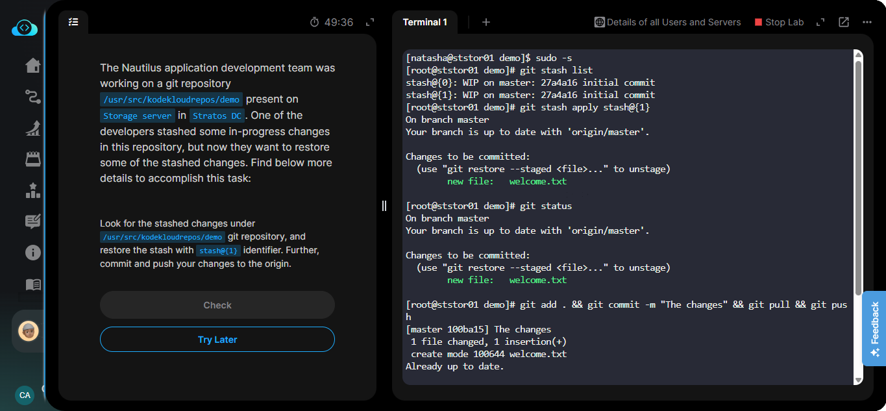

# 🗓️ DAY 31 / 100

100 Days of DevOps 🚀 

GIT STASH.

The task was to restore the stash with id `stash@{1}`, commit and push it. I went about it by . . .

1️⃣ Checking the stash with `sudo git stash`

2️⃣ Restoring the particular one I wanted with `sudo git stash apply stash@{1}`

3️⃣ Committing the changes and pushing it to the remote repository.

