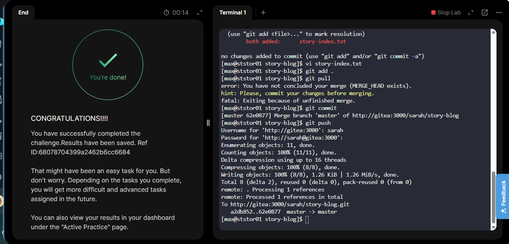

# 🗓️ Day 33 / 100 🎉 

100 Days of DevOps 🚀 

RESOLVE MERGE CONFLICTS

Another user has changed a file you changed, and you want to pull but there are conflicting versions. What do you do?

I went into the file, corrected it, staged it with `git add` and continued the merging with `git commit`.

